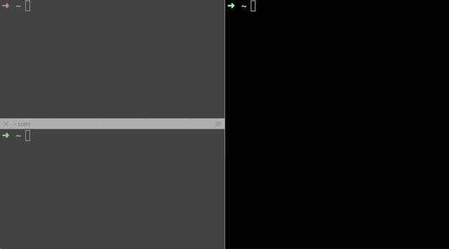

# httpmole

[](https://travis-ci.com/jcchavezs/httpmole)

**httpmole** provides a HTTP mock server that will act as a mole among your services, telling you everything http clients send to it and responding them whatever you want it to respond. Just like an actual mole.



**Features:**

- Use `response-status` and `response-header` to quickly spin up a http server.
- Use `response-file` to **modify the response in real time** using a text editor.
- Use `response-from` to act as a proxy and be able to inspect the request/response going to a given service.

## Install

```bash
go install github.com/jcchavezs/httpmole/cmd/httpmole
```

## Usage

### Using the binary

```bash
httpmole -p=8082 -response-status=200
```

or using a response file:

```bash
httpmole -p=8082 -response-file=./myresponse.json
```

```json
// myresponse.json
{
    "status_code": 200,
    "headers": {
        "content-type": "application/json"
    },
    "body": {
        "message": "I am real"
    }
}
```

or proxying a service to inspect the incoming requests:

```bash
httpmole -p=8082 -response-from=therealservice:8082
```

### Using docker

```bash
docker run -p "10080:10080" jcchavezs/httpmole -response-status=201
```

or pass a response file over volumes

```bash
docker run -p "10080:10080" -v `pwd`/response.json:/httpmole/response.json jcchavezs/httpmole -response-file=/httpmole/response.json
```

Docker image is [hosted in dockerhub](https://hub.docker.com/repository/docker/jcchavezs/httpmole
)

**httpmole** is heavily inspired by [httplab](https://github.com/gchaincl/httplab)
